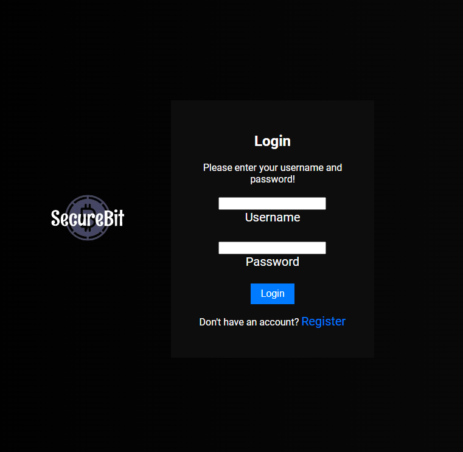

# OASIS INFOBYTE - Web Development and Designing

## Task 4: Login Authentication


SecureBit is a secure bitcoin management system designed to provide users with a safe and reliable platform for managing their bitcoin assets. With SecureBit, users can securely store, monitor, and transact with their bitcoins, ensuring peace of mind and ease of use.

This project demonstrates a simple login authentication system using Flask, Flask-Login, and bcrypt for password hashing. It includes functionality for user registration, login, logout, and accessing secured pages.

## Setup and Installation

1. Clone the repository to your local machine:

    ```bash
    git clone <repository_url>
    ```

2. Install the required dependencies using pip:

    ```bash
    pip install flask flask-login bcrypt
    ```

3. Run the Flask application:

    ```bash
    python app.py
    ```

4. Open your web browser and navigate to `http://localhost:5000` to access the login page.

## Features

- **User Registration**: Users can register by providing a username and password. Passwords are hashed using bcrypt before storing in the database.

- **Login**: Registered users can log in using their credentials. Passwords are hashed and compared with the stored hashed passwords for authentication.

- **Session Management**: Flask-Login manages user sessions and provides decorators like `@login_required` to restrict access to secured pages.

- **Logout**: Users can log out of their session, terminating their access to secured pages.

- **Secured Page**: Access to certain pages is restricted to authenticated users. Users attempting to access secured pages without logging in will be redirected to the login page.

- **Bitcoin Data Display**: A secured page displays simulated Bitcoin data, including balance and current price fetched from the server asynchronously using JavaScript Fetch API.

## Screenshots




### Dependencies

- **Flask**: Micro web framework for Python.
- **Flask-Login**: Provides user session management and authentication functionalities for Flask applications.
- **bcrypt**: Library for password hashing.

